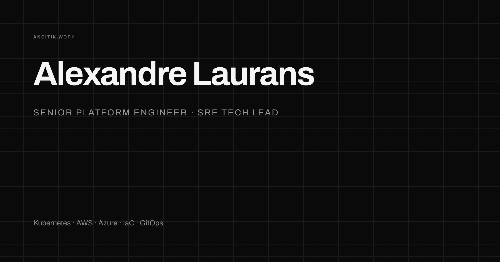

# ancitik.work



Personal portfolio of **Alexandre Laurans** — Senior Platform Engineer · SRE Tech Lead.

**Live:** [ancitik.work](https://ancitik.work)

## Stack

- [Astro 5](https://astro.build) — fully static one-pager, zero JS framework
- Self-hosted fonts: Archivo (display) + Space Grotesk (body), via Fontsource
- Cloudflare Workers (static assets) — deployed by GitHub Actions on push to `main`

## Design

Swiss Modernism on a dark canvas: strict black & white, thin background grid, asymmetric modular layouts, ghost section numerals, hairline tables. Zero border-radius, no shadows. Lighthouse 100 across the board.

## Development

```bash
npm install
npm run dev      # local dev server
npm run build    # static build to ./dist
npm run preview  # serve the production build
```

## Deployment

Push to `main` triggers `.github/workflows/deploy.yml`: build, then `wrangler deploy` to Cloudflare Workers with the `ancitik.work` custom domain. Requires the `CLOUDFLARE_API_TOKEN` and `CLOUDFLARE_ACCOUNT_ID` repository secrets.

All content lives in [`src/data/profile.ts`](src/data/profile.ts) — edit there, push, done.
